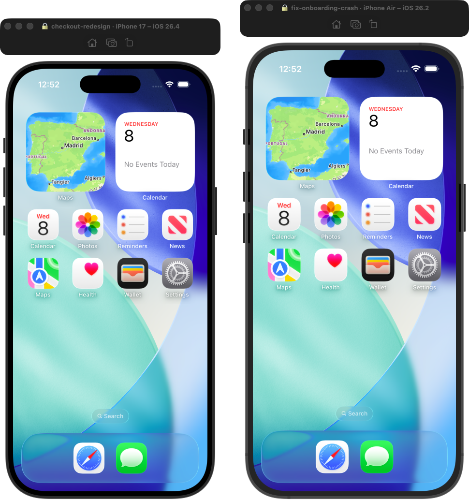

# SimLease

**Stop your AI agents from fighting over iOS simulators.**

When you run several AI coding agents in parallel — Claude Code sessions, Codex, multiple worktrees — they collide: one agent reinstalls over the simulator another is testing, and you end up staring at five identical iPhone windows with no idea which task each belongs to.

SimLease fixes both:

- 🔒 **Leases** — an agent claims a simulator and owns it until it releases it (or the lease expires). Other agents automatically get a different device.
- 🏷️ **Names** — the claimed simulator is renamed, so the window title literally reads `🔒 checkout-redesign · iPhone 17 Pro`. You always know which window is which task.
- 📋 **A menubar board** — SimLease.app shows every lease (task, device, agent, time left). Click a row to bring that simulator's window to the front.



## Install

```bash
git clone https://github.com/alexissan/simlease.git
cd simlease
make install          # installs the simlease CLI (PREFIX=/usr/local by default)
make app              # builds dist/SimLease.app (the menubar board)
open dist/SimLease.app
```

Requires macOS 14+ and Xcode (for `simctl`).

## 60-second quickstart

```bash
$ simlease claim --label "checkout-redesign"
🔒 Assigned iPhone 17 Pro (199D590E) for "checkout-redesign"
199D590E-8268-4E3E-A7E3-E13DACF9C0C7

$ simlease status
checkout-redesign  —  iPhone 17 Pro [Booted]  claude-code  1h 59m left
    199D590E-8268-4E3E-A7E3-E13DACF9C0C7  /Users/you/dev/my-app

$ simlease release
🧹 Released iPhone 17 Pro ("checkout-redesign")
```

`claim` prints the UDID on stdout (everything human goes to stderr), so it drops straight into build scripts:

```bash
SIMULATOR_ID=$(simlease claim --label "$(git branch --show-current)")
xcodebuild -destination "id=$SIMULATOR_ID" ...
```

## Using it with AI agents

Add this to your `CLAUDE.md` (or any agent's instructions):

```markdown
## Simulators
- Before building/running on a simulator, claim one: `SIMULATOR_ID=$(simlease claim)`
- The claim is sticky per directory — re-running `simlease claim` returns the same device.
- Renew during long sessions: `simlease renew`
- When the task is done: `simlease release`
- Never use a simulator whose name starts with 🔒 that you didn't claim.
```

Each agent (or worktree, or session) claims from its own working directory, and the lease is keyed to that directory — parallel agents can't take each other's devices.

## CLI reference

| Command | Behavior |
|---|---|
| `simlease claim` | Claim/reuse a simulator for this directory. `--label` (default: git branch), `--agent`, `--device "iPhone 17 Pro"`, `--ttl 2h`, `--no-rename`, `--no-boot`, `--json`. Prints the UDID on stdout. |
| `simlease release` | Free this directory's sim (or `--udid` / `--label`). Restores the original device name; deletes sims SimLease created. |
| `simlease renew` | Extend the lease (default `--ttl 2h`). Call it from build scripts as a heartbeat. |
| `simlease status` | Show all leases: task, device, state, agent, time left. `--json` for machines. |
| `simlease gc` | Reap expired leases and leases whose working directory is gone. |
| `simlease focus <label\|udid>` | Bring that simulator's window to the front (omit the argument for this directory's sim). |

## The menubar app

SimLease.app is a tiny menubar-only app that watches the lease registry:


- 🟢 booted / ⚪️ shut down, task label, device, agent, expired flag
- Click a row → **Focus window**, **Release lease**, or **Copy UDID**
- **Run GC** to clean up leftovers from crashed agents

## How it works

- The registry is a single JSON file at `~/.simlease/registry.json` — the CLI and the app share it, and you can read it yourself.
- Claims are serialized through an atomic `mkdir` lock (`~/.simlease/lock`) with stale-lock stealing, so simultaneous claims from parallel agents always get distinct devices.
- Allocation is sticky: the same directory re-claims the same warm device (your app stays installed). Otherwise it takes a free device, preferring the newest iPhone Pros; if everything is taken it creates a fresh simulator on the latest iOS runtime.
- Every lease has a TTL (default 2h). A crashed agent's lease expires and the device returns to the pool — GC restores its name automatically.

## FAQ

**Does it mess with my simulators?**
It renames a device while leased and restores the exact original name on release (or GC). It never deletes a simulator it didn't create itself.

**What if an agent crashes without releasing?**
The lease expires after its TTL. The next `claim` or `gc` restores the device name and frees it.

**Does the other agent have to use SimLease too?**
The lock is cooperative — agents that claim through SimLease never collide. Agents that ignore it can still grab any device, but the 🔒 in the device name makes "this one is taken" visible to both humans and models.

## Roadmap

- Homebrew tap
- Notarized app releases
- Per-task colors

## License

MIT — see [LICENSE](LICENSE).
